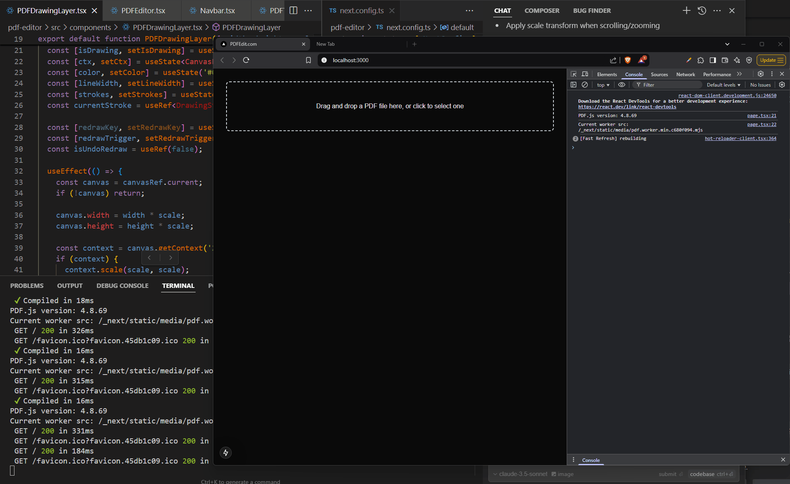
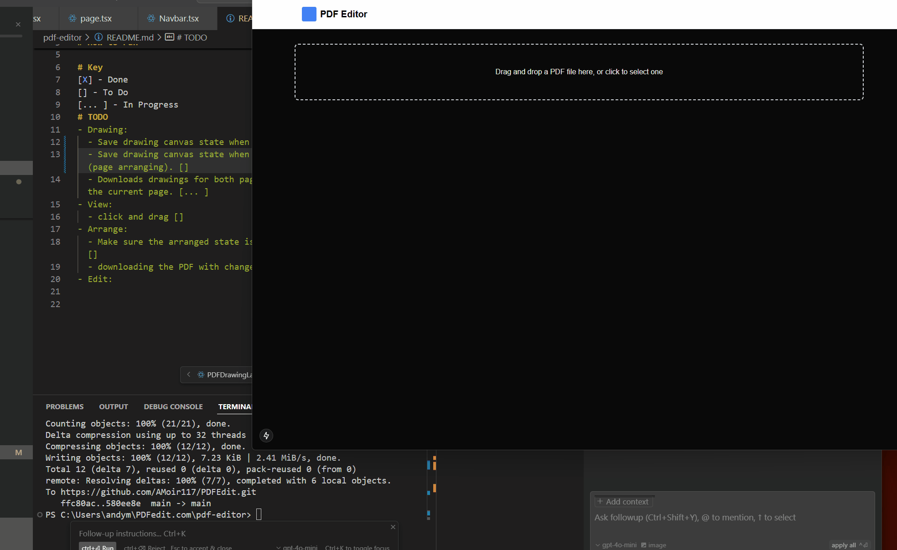

# PDF-Edit

# How to run
npm run dev

# Key
[X] - Done
[] - To Do
[... ] - In Progress
# TODO
- Drawing:
  - Save drawing canvas state when switching to another Page. [X]
  - Save drawing canvas state when switching to another Edit Mode (page arranging). []
  - Downloads drawings for both pages. rn it mirrors the drawings of the current page. [... ]
- View:
  - click and drag []
- Arrange:
  - Make sure the arranged state is saved for the other Edit Modes [] 
  - downloading the PDF with changes. [X]
- Edit:
  - Add edit & add text functionality. [... ]

# GIFs

